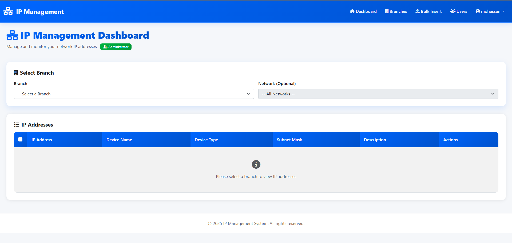

# IP Management System

A comprehensive Django-based web application for managing IP addresses across multiple branches and networks. This system provides role-based access control, bulk operations, and network monitoring capabilities.


## Features

- 🏢 **Multi-Branch Management** - Organize IP addresses by different branches/locations
- 🔐 **Role-Based Access Control** - Admin and user-level permissions
- 📊 **Network Organization** - Manage IPs by subnets and device types
- 🚀 **Bulk Operations** - Insert thousands of IP addresses at once
- 🔍 **Advanced Search & Filtering** - Find IPs quickly with DataTables integration
- 📡 **Ping Functionality** - Test device connectivity directly from the interface
- 👥 **User Management** - Complete user administration system
- 📱 **Responsive Design** - Works seamlessly on desktop and mobile devices

## Screenshots

### Dashboard


### Bulk Insert


### Users List


### Branches List


## Technology Stack

- **Backend:** Django 5.2
- **Database:** PostgreSQL 12+
- **Frontend:** Bootstrap 5, jQuery, DataTables
- **Icons:** Font Awesome 6
- **Additional Libraries:** Select2, Chart.js

## Prerequisites

Before you begin, ensure you have the following installed:

- **Python 3.8 or higher**
- **PostgreSQL 12 or higher**
- **pip** (Python package manager)
- **virtualenv** (recommended)

## Installation Guide

### Step 1: Clone the Repository

```bash
git clone https://github.com/yourusername/ip_management.git
cd ip_management
```

### Step 2: Create Virtual Environment

```bash
# Create virtual environment
python -m venv venv

# Activate virtual environment
# On Windows:
venv\Scripts\activate

# On macOS/Linux:
source venv/bin/activate
```

### Step 3: Install Dependencies

```bash
pip install -r requirements.txt
```

**requirements.txt:**
```txt
Django==5.2
psycopg2-binary==2.9.9
python-decouple==3.8
Pillow==10.3.0
```

### Step 4: PostgreSQL Database Setup

#### 4.1: Create Database

Open PostgreSQL command line (psql) or pgAdmin and run:

```sql
-- Create database
CREATE DATABASE ip_management_db;

-- Create user (optional - you can use existing postgres user)
CREATE USER ip_admin WITH PASSWORD 'your_secure_password';

-- Grant privileges
ALTER ROLE ip_admin SET client_encoding TO 'utf8';
ALTER ROLE ip_admin SET default_transaction_isolation TO 'read committed';
ALTER ROLE ip_admin SET timezone TO 'UTC';
GRANT ALL PRIVILEGES ON DATABASE ip_management_db TO ip_admin;
```

#### 4.2: Configure Database Settings

Open `ip_management/settings.py` and update the database configuration:

```python
DATABASES = {
    'default': {
        'ENGINE': 'django.db.backends.postgresql',
        'NAME': 'ip_management_db',      # Your database name
        'USER': 'postgres',               # Your database user
        'PASSWORD': 'your_secure_password', # Your database password
        'HOST': 'localhost',              # Or your DB server IP
        'PORT': '5432',                   # Default PostgreSQL port
    }
}
```

**Important Security Note:** For production, use environment variables instead of hardcoding credentials:

```python
import os
from decouple import config

DATABASES = {
    'default': {
        'ENGINE': 'django.db.backends.postgresql',
        'NAME': config('DB_NAME'),
        'USER': config('DB_USER'),
        'PASSWORD': config('DB_PASSWORD'),
        'HOST': config('DB_HOST', default='localhost'),
        'PORT': config('DB_PORT', default='5432'),
    }
}
```

Create a `.env` file in the project root:
```env
DB_NAME=ip_management_db
DB_USER=ip_admin
DB_PASSWORD=your_secure_password
DB_HOST=localhost
DB_PORT=5432
```

### Step 5: Run Database Migrations

```bash
# Create database tables
python manage.py makemigrations
python manage.py migrate
```

### Step 6: Load Initial Data (Subnets & Device Types)

After migrations, load the initial data from `query.sql`:

```bash
# Connect to your PostgreSQL database
psql -U ip_admin -d ip_management_db

# Inside psql, run:
\i query.sql

# Or directly from command line:
psql -U ip_admin -d ip_management_db -f query.sql
```

**Note:** The `query.sql` file contains:
- 32 subnet masks (/1 to /32)
- 27 device types (Router, Switch, Server, etc.)

### Step 7: Create Superuser

```bash
python manage.py createsuperuser
```

Follow the prompts to create your admin account:
- Username: (your choice)
- Email: (your email)
- Password: (secure password)

### Step 8: Collect Static Files

```bash
python manage.py collectstatic
```

### Step 9: Run the Development Server

```bash
python manage.py runserver
```

The application will be available at: **http://127.0.0.1:8000**

## Initial Setup After Installation

### 1. Login

Navigate to http://127.0.0.1:8000 and login with your superuser credentials.

### 2. Create Branches

1. Go to **Branches** menu
2. Click **Add New Branch**
3. Create your first branch (e.g., "Main Office", "Branch 1", etc.)

### 3. Create Users (Optional)

1. Go to **Users** menu
2. Click **Add New User**
3. Assign roles:
   - **Admin**: Full access to all branches and features
   - **User**: Limited to assigned branch only

### 4. Add IP Addresses

You can add IPs in two ways:

#### Manual Entry:
1. Select a branch from the dashboard
2. Click on an IP row to edit
3. Fill in the details and save

#### Bulk Insert:
1. Go to **Bulk Insert** menu
2. Enter IP range (e.g., 192.168.1.1 to 192.168.1.254)
3. Select subnet, branch, and device type
4. Click **Start Bulk Insert**

## User Guide

### Dashboard Features

- **Branch Selection**: Filter IPs by branch
- **Network Filter**: View specific network ranges
- **Search**: Find IPs by address, device name, or description
- **Ping**: Test device connectivity
- **Edit**: Modify IP details (if you have permission)
- **Bulk Actions**: Select multiple IPs for bulk operations (Admin only)

### Admin Features

Administrators have additional capabilities:

- **Branch Management**: Create, edit, and delete branches
- **User Management**: Manage user accounts and permissions
- **Bulk Operations**: Insert or delete multiple IPs at once
- **Full Access**: View and edit all branches

### User Permissions

| Action | Admin | User |
|--------|-------|------|
| View IPs in assigned branch | ✅ | ✅ |
| View IPs in all branches | ✅ | ❌ |
| Edit IPs in assigned branch | ✅ | ✅ |
| Edit IPs in other branches | ✅ | ❌ |
| Create/Edit branches | ✅ | ❌ |
| Bulk insert/delete | ✅ | ❌ |
| Manage users | ✅ | ❌ |
| Ping devices | ✅ | ✅ |

## Configuration

### Security Settings (Production)

Before deploying to production, update `settings.py`:

```python
# SECURITY WARNING: don't run with debug turned on in production!
DEBUG = False

# SECURITY WARNING: keep the secret key used in production secret!
SECRET_KEY = config('SECRET_KEY')

# Update allowed hosts
ALLOWED_HOSTS = ['yourdomain.com', 'www.yourdomain.com']

# Enable HTTPS
SECURE_SSL_REDIRECT = True
SESSION_COOKIE_SECURE = True
CSRF_COOKIE_SECURE = True
```

### Email Configuration (Optional)

For password reset features, configure email in `settings.py`:

```python
EMAIL_BACKEND = 'django.core.mail.backends.smtp.EmailBackend'
EMAIL_HOST = 'smtp.gmail.com'
EMAIL_PORT = 587
EMAIL_USE_TLS = True
EMAIL_HOST_USER = config('EMAIL_USER')
EMAIL_HOST_PASSWORD = config('EMAIL_PASSWORD')
```

## Troubleshooting

### Database Connection Error

**Problem:** `psycopg2.OperationalError: could not connect to server`

**Solution:**
1. Verify PostgreSQL is running: `sudo service postgresql status`
2. Check database credentials in `settings.py`
3. Ensure database exists: `psql -l`

### Port Already in Use

**Problem:** `Error: That port is already in use.`

**Solution:**
```bash
# Run on different port
python manage.py runserver 8080

# Or kill process using port 8000
# On Linux/Mac:
lsof -ti:8000 | xargs kill -9

# On Windows:
netstat -ano | findstr :8000
taskkill /PID <PID> /F
```

### Static Files Not Loading

**Problem:** CSS/JS files not loading

**Solution:**
```bash
python manage.py collectstatic --clear
python manage.py collectstatic
```

### Migration Issues

**Problem:** Migration conflicts

**Solution:**
```bash
# Reset migrations (CAUTION: Data loss!)
python manage.py migrate --fake ips zero
python manage.py migrate ips
```

## Performance Optimization

### For Large Databases (100k+ IPs)

1. **Enable PostgreSQL Indexing:**
   The models already include indexes, but verify:
   ```sql
   \d ips  -- Shows table indexes
   ```

2. **Optimize Queries:**
   - Use `select_related()` for foreign keys
   - Use `prefetch_related()` for many-to-many
   - Already implemented in `get_ips_datatable` view

3. **Database Tuning:**
   Update PostgreSQL configuration:
   ```
   shared_buffers = 256MB
   effective_cache_size = 1GB
   work_mem = 10MB
   ```

## API Endpoints

The application provides several API endpoints:

| Endpoint | Method | Description |
|----------|--------|-------------|
| `/api/branches/` | GET | List all branches |
| `/api/networks/` | GET | List networks for a branch |
| `/api/device-types/` | GET | List all device types |
| `/api/subnets/` | GET | List all subnets |
| `/api/ips/datatable/` | POST | DataTables server-side processing |
| `/api/ips/bulk-delete/` | POST | Delete multiple IPs |

## Database Schema

### Main Tables

- **branches**: Branch/location information
- **user_profiles**: Extended user information with branch assignments
- **device_types**: Types of network devices
- **subnets**: Subnet masks and calculations
- **ips**: IP address records

### Relationships

```
User (Django) ─┬─ UserProfile ─── Branch
               │
               └─ IP ──┬─── Branch
                       ├─── DeviceType
                       └─── Subnet
```

## Backup & Restore

### Backup Database

```bash
# Full backup
pg_dump -U ip_admin ip_management_db > backup_$(date +%Y%m%d).sql

# Compressed backup
pg_dump -U ip_admin ip_management_db | gzip > backup_$(date +%Y%m%d).sql.gz
```

### Restore Database

```bash
# From SQL file
psql -U ip_admin ip_management_db < backup_20250101.sql

# From compressed file
gunzip -c backup_20250101.sql.gz | psql -U ip_admin ip_management_db
```

## Contributing

Contributions are welcome! Please follow these steps:

1. Fork the repository
2. Create a feature branch: `git checkout -b feature-name`
3. Commit changes: `git commit -am 'Add feature'`
4. Push to branch: `git push origin feature-name`
5. Submit a pull request


## Support

For issues, questions, or suggestions:

- **Email**: mohamed.elsawsany10@gmail.com

## Changelog

### Version 1.0.0 (2025-01-06)
- Initial release
- Multi-branch IP management
- User authentication and authorization
- Bulk insert functionality
- Ping feature
- DataTables integration
- Responsive design

## Acknowledgments

- Django Team for the excellent framework
- Bootstrap for the UI components
- DataTables for advanced table features
- Font Awesome for icons
- The open-source community

---

**Made with ❤️ by Mohamed Elsawsany**

**Project Repository:** https://github.com/MohamedElsawsany/ip_management_django_ver.git